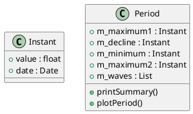

# Objects model

```plantuml

@startuml

class Instant {
    +value : float
    +date : Date
}

class Period {
 +m_maximum1 : Instant
 +m_decline : Instant
 +m_minimum : Instant
 +m_maximum2 : Instant
 +m_waves : List

 +printSummary()
 +plotPeriod()
}

@enduml

```
