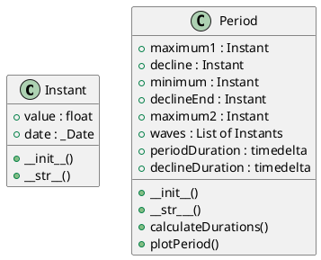

# Objects model

```plantuml

@startuml

class Instant {
    +value : float
    +date : _Date

    +__init__()
    +__str__()
}

class Period {
 +maximum1 : Instant
 +decline : Instant
 +minimum : Instant
 +declineEnd : Instant
 +maximum2 : Instant
 +waves : List of Instants
 +periodDuration : timedelta
 +declineDuration : timedelta

 +__init__()
 +__str___()
 +calculateDurations()
 +plotPeriod()
}

@enduml

```
